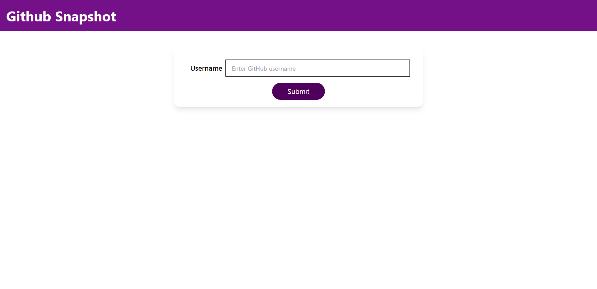

# github-snapshot

## Description
This is a web application built to fetch and display public information about GitHub users by their usernames.

## Features
- A web application built to fetch and display public information about GitHub users by their usernames.
- Allows users to enter a GitHub username and see details like avatar image, name, public repositories, and more.
- Implemented using React.js and the GitHub API.

## Tech Stack
React: A popular JavaScript library for building user interfaces.
JavaScript: For implementing app logic and interactivity.
Tailwind CSS: Styled the application using Tailwind CSS to ensure an appealing and user-friendly design.

## Getting Started
Clone this repository to your local machine using git clone `https://github.com/akashsonkamble/github-snapshot.git`
Navigate to the project directory and install dependencies using `npm install`
Start the development server using `npm run dev`
Open your web browser and visit `http://localhost:5173` to see the app in action.
